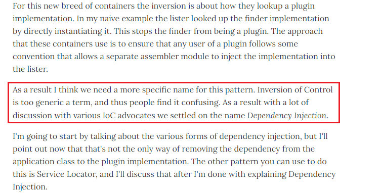

https://docs.spring.io/spring-framework/docs/3.2.x/spring-framework-reference/html/beans.html

https://www.baeldung.com/inversion-control-and-dependency-injection-in-spring

https://www.cnblogs.com/tanghaorong/p/13364634.html  中文解释 解释的比较好 

> IoC enables a framework to take control of the flow of a program and make calls to our custom code


# 1 What Is Inversion of Control

[Inversion of Control](https://www.baeldung.com/cs/ioc) is a principle in software engineering which transfers the control of objects or portions of a program to a container or framework. We most often use it in the context of object-oriented programming.

In contrast with traditional programming, in which our custom code makes calls to a library, ==IoC enables a framework to take control of the flow of a program and make calls to our custom code==. To enable this, frameworks use abstractions with additional behavior built in. ==**If we want to add our own behavior, we need to extend the classes of the framework or plugin our own classes.**==

The advantages of this architecture are:
- decoupling the execution of a task from its implementation
- making it easier to switch between different implementations
- greater modularity of a program
- greater ease in testing a program by isolating a component or mocking its dependencies, and allowing components to communicate through contracts


---

IoC（Inversion of Control）的意思是“控制反转”，它是Spring最核心的点，并且贯穿始终。IoC并不是一门技术，而是一种设计思想。在Spring框架中实现控制反转的是Spring IoC容器，其具体就是由容器来控制对象的生命周期和业务对象之间的依赖关系，而不是像传统方式(new 对象)中由代码来直接控制。程序中所有的对象都会在Spring IoC容器中登记，告诉容器你是个什么，你需要什么，然后IoC容器会在系统运行到适当的时候，把你要的对象主动给你，同时也把你交给其它需要你的对象。也就是说控制对象生存周期的不再是引用它的对象，而是由Spring IoC容器来控制所有对象的创建、销毁。对于某个具体的对象而言，以前是它控制其它对象，现在是所有对象都被Spring IoC容器所控制，所以这叫控制反转。

控制反转最直观的表达就是，IoC容器让对象的创建不用去new了，而是由Spring自动生产，使用java的反射机制，根据配置文件在运行时动态的去创建对象以及管理对象，并调用对象的方法。控制反转的本质是控制权由应用代码转到了外部容器(IoC容器)，控制权的转移即是所谓的反转。控制权的转移带来的好处就是降低了业务对象之间的依赖程度，即实现了解耦。即然控制反转中提到了反转，那么肯定有正转，正转和反转有什么区别呢？我曾经在博客上看到有人在面试的时候被问到Spring IoC知识点：什么是反转、正转？

- 正转：如果我们要使用某个对象，就需要自己负责对象的创建。
- 反转：如果要使用某个对象，只需要从Spring 容器中获取需要使用的对象，不关心对象的创建过程，也就是把创建对象的控制权反转给了Spring框架。


# 2 IoC 和 DI 之间的关系 

DI（Dependency Injection）的意思是"依赖注入"，**它是IoC(控制反转)的一个别名为**。在早些年，软件开发教父`Martin·Fowler`在一篇文章中提到将IoC改名为 DI，这是原文地址：[https://martinfowler.com/articles/injection.html](https://martinfowler.com/articles/injection.html)。其中有这样一段话，如下图所示：




Dependency Injection 具体能够实现 Inversion of Control  的 mechanisms 
We can achieve Inversion of Control through various mechanisms such as: Strategy design pattern, Service Locator pattern, Factory pattern, and Dependency Injection (DI).


意思是：他认为需要为该模式(IoC)指定一个更具体的名称。因为控制反转是一个过于笼统的术语，所以人们会感到困惑。他与IoC的倡导者进行了大量讨论之后，然后他们决定使用依赖注入这个名称。也就是在这时DI(依赖注入)这个词被大家知晓。我在第一章的时候也提到过，IoC和DI其实是同一个概念，只是从不同的角度描述罢了(IoC是一种思想，而DI则是一种具体的技术实现手段)。

这是我们在其它地方看到的一句话，这句话真的是醍醐灌顶，一句话就把其它人一大堆很难懂的话给说清楚了：==IoC是目的(它的目的是创建对象)，DI是手段(通过什么手段获取外部对象).== 

依赖注入：即应用程序在运行时依赖IoC容器来动态注入对象需要的外部资源。依赖注入中"谁依赖谁，为什么需要依赖，谁注入谁，注入了什么"，下面来深入分析一下：

　- 谁依赖于谁：当然是应用程序依赖于IoC容器；
　- 为什么需要依赖：应用程序需要IoC容器来提供对象需要的外部资源；
　- 谁注入谁：很明显是IoC容器注入应用程序某个对象，应用程序依赖的对象；
　- 注入了什么：就是注入某个对象所需要的外部资源（包括对象、资源、常量数据）。

**综合上述，我们可以用一句话来概括：所谓Spring IoC/DI，就是由 Spring 容器来负责对象的生命周期和对象之间的依赖关系。**


## 2.1 What Is Dependency Injection

一个control 被植入 通过设立object’s dependencies
control 是干什么的: 添加 control,  add our own behavior add tp framework， 使得 这个 framework 可以  ake control of the flow of a program and make calls to our custom code

Dependency injection is a pattern we can use to implement IoC, where ==the control being inverted is setting an object’s dependencies.==

Connecting objects with other objects, or “injecting” objects into other objects, is done by an assembler rather than by the objects themselves.

Here’s how we would create an object dependency in traditional programming:

```java
public class Store {
    private Item item;
 
    public Store() {
        item = new ItemImpl1();    
    }
}
```

In the example above, we need to instantiate an implementation of the _Item_ interface within the _Store_ class itself.

By using DI, we can rewrite the example without specifying the implementation of the _Item_ that we want:
```java
public class Store {
    private Item item;
    public Store(Item item) {
        this.item = item;
    }
}
```

In the next sections, we’ll look at how we can provide the implementation of _Item_ through metadata.

Both IoC and DI are simple concepts, but they have deep implications in the way we structure our systems, so they’re well worth understanding fully.


# 3 Introduction to the Spring IoC container and beans

This chapter covers the Spring Framework implementation of the Inversion of Control (IoC) [[1]](https://docs.spring.io/spring-framework/docs/3.2.x/spring-framework-reference/html/beans.html#ftn.d5e1144)principle. IoC is also known as _dependency injection_ (DI). It is a process whereby objects define their dependencies, that is, the other objects they work with, only through constructor arguments, arguments to a factory method, or properties that are set on the object instance after it is constructed or returned from a factory method. The container then _injects_ those dependencies when it creates the bean. This process is fundamentally the inverse, hence the name _Inversion of Control_ (IoC), of the bean itself controlling the instantiation or location of its dependencies by using direct construction of classes, or a mechanism such as the _Service Locator_ pattern.

The `org.springframework.beans` and `org.springframework.context` packages are the basis for Spring Framework's IoC container. The `[BeanFactory](http://static.springsource.org/spring-framework/docs/current/javadoc-api/org/springframework/beans/factory/BeanFactory.html)` interface provides an advanced configuration mechanism capable of managing any type of object. `[ApplicationContext](http://static.springsource.org/spring-framework/docs/current/javadoc-api/org/springframework/context/ApplicationContext.html)` is a sub-interface of `BeanFactory.` It adds easier integration with Spring's AOP features; message resource handling (for use in internationalization), event publication; and application-layer specific contexts such as the `WebApplicationContext` for use in web applications.

In short, the `BeanFactory` provides the configuration framework and basic functionality, and the `ApplicationContext` adds more enterprise-specific functionality. The `ApplicationContext` is a complete superset of the `BeanFactory`, and is used exclusively in this chapter in descriptions of Spring's IoC container. For more information on using the `BeanFactory` instead of the `ApplicationContext,` refer to [Section 5.15, “The BeanFactory”](https://docs.spring.io/spring-framework/docs/3.2.x/spring-framework-reference/html/beans.html#beans-beanfactory "5.15 The BeanFactory").

In Spring, the objects that form the backbone of your application and that are managed by the Spring IoC _container_ are called _beans_. A bean is an object that is instantiated, assembled, and otherwise managed by a Spring IoC container. Otherwise, a bean is simply one of many objects in your application. Beans, and the _dependencies_ among them, are reflected in the _configuration metadata_ used by a container.


# 4 对SpringIoC的理解


上面已经详细介绍了IoC和DI的基本概念，为了更好的理解它们，所以接下来用一个生活中的例子来加深理解。在举例之前，先要搞清楚，依赖关系的处理方式有两种：

- **主动创建对象**
- **被动创建对象**

  

**①、主动创建对象**

我们知道，在传统的Java项目中，如果需要在一个对象中内部调用另一个对象的方法，最常用的就是在主体类中使用`new 对象`的方式。当然我们也可以使用简单工厂模式来实现，就是在简单工厂模式中，我们的被依赖类由一个工厂方法创建，依赖主体先调用被依赖对象的工厂方法，接着主动基于工厂访问被依赖对象，但这种方式任然存在问题，即依赖主体与被依赖对象的工厂之间存在着耦合。主动创建对象的程序思想图如下所示：


举例：这是我在购买的《Java EE 互联网轻量级框架整合开发》一书中看到的一个栗子，我觉得作者的这个栗子通俗易懂，因为它源自生活。例如我们平时想要喝一杯柠檬汁，在不去饮品店购买的情况下，那么我们自己想要的得到一杯橙汁的想法是这样的：买果汁机、买橙子，买杯子，然后准备水。这些都是你自己"主动"完成的过程，也就是说一杯橙汁需要你自己创造。如下图所示：


  

**②、被动创建对象**

由于主动创建对象的方式是很难避免耦合问题，所以通过思考总结有人通过容器来统一管理对象，然后逐渐引起了大家的注意，进而开启了被动创建对象的思潮。也正是由于容器的引入，使得应用程序不需要再主动去创建对象了，可见获取对象的过程被反转了，从主动获取变成了被动接受，这也是控制反转的过程。被动创建对象的程序思想图如下所示：


举例：在饮品店如此盛行的今天，不会还有人自己在家里制作饮品、奶茶吧！所以我们的首选肯定是去外面购买或者是外卖。那此时我们只需要描述自己需要什么饮品即可(加冰热糖忽略)，不需要在乎我们的饮品是怎么制作的。而这些正是由别人"被动"完成的过程，也就是说一杯饮品需要别人被动创造。如下图所示：


通过上图的例子我们可以发现，我们得到一杯橙汁并没有由自己"主动"去创造，而是通过饮品店创造的，然而也完全达到了你的要求，甚至比你创造的要好上那么一些。

上面的例子只能看出不需要我们自己创建对象了，那万一它还依赖于其它对象呢？那么对象之间要相互调用呢？我们要怎么来理解呢？下面接着举例。

假如这个饮品店的商家是一个奸商，为了节约成本，它们在饮品中添加添加剂，举例如下图所示：


在主体对象依赖其它对象的时候，对象之间的相互调用通过注入的方式来完成，所以下面我们介绍IOC中的三种注入方式。

至此为止对Spring IOC/DI的理解已经全部介绍完了，也不知道你们看没看懂，或者是我本身理解有误，还请大家多多指教！！！


# 5 IoC的三种注入方式


对IoC模式最有权威的总结和解释，应该是软件开发教父`Martin Fowler`的那篇文章"Inversion of Control Containers and the Dependency Injection pattern"，上面已经给出了链接，这里再说一遍：[https://martinfowler.com/articles/injection.html](https://martinfowler.com/articles/injection.html)。在这篇文章中提到了三种依赖注入的方式，即构造方法注入(constructor injection)，setter方法注入(setter injection)以及接口注入(interface injection)。


所以下面让来详细看一下这三种方式的特点及其相互之间的差别：

## 5.1 构造函数注入

构造方法注入，顾名思义就是被注入对象可以通过在其构造方法中声明依赖对象的参数列表，让外部（通常是IoC容器）知道它需要哪些依赖对象。

IoC Service Provider会检查被注入对象的构造方法，取得它所需要的依赖对象列表，进而为其注入相应的对象。同一个对象是不可能被构造两次的，因此，被注入对象的构造乃至其整个生命周期，应该是由IoC Service Provider来管理的。

构造方法注入方式比较直观，对象被构造完成后，即进入就绪状态，可以马上使用。这就好比你刚进酒吧的门，服务生已经将你喜欢的啤酒摆上了桌面一样。坐下就可马上享受一份清凉与惬意。

  

## 5.2 set方法注入

对于JavaBean对象来说，通常会通过setXXX()和getXXX()方法来访问对应属性。这些setXXX()方法统称为setter方法，getXXX()当然就称为getter方法。通过setter方法，可以更改相应的对象属性，通过getter方法，可以获得相应属性的状态。所以，当前对象只要为其依赖对象所对应的属性添加setter方法，就可以通过setter方法将相应的依赖对象设置到被注入对象中。

setter方法注入虽不像构造方法注入那样，让对象构造完成后即可使用，但相对来说更宽松一些，可以在对象构造完成后再注入。这就好比你可以到酒吧坐下后再决定要点什么啤酒，可以要百威，也可以要大雪，随意性比较强。如果你不急着喝，这种方式当然是最适合你的。

  

## 5.3 接口注入

相对于前两种注入方式来说，接口注入没有那么简单明了。被注入对象如果想要IoC ServiceProvider为其注入依赖对象，就必须实现某个接口。这个接口提供一个方法，用来为其注入依赖对象。IoC Service Provider最终通过这些接口来了解应该为被注入对象注入什么依赖对象。

  

## 5.4 三种注入方式的比较

|注入方式|描述|
|---|---|
|setter方法注入|因为方法可以命名，所以setter方法注入在描述性上要比构造方法注入好一些。 另外，setter方法可以被继承，允许设置默认值，而且有良好的IDE支持。缺点当然就是对象无法在构造完成后马上进入就绪状态。|
|构造方法注入|这种注入方式的优点就是，对象在构造完成之后，即已进入就绪状态，可以 马上使用。缺点就是，当依赖对象比较多的时候，构造方法的参数列表会比较长。而通过反射构造对象的时候，对相同类型的参数的处理会比较困难，维护和使用上也比较麻烦。而且在Java中，构造方法无法被继承，无法设置默认值。对于非必须的依赖处理，可能需要引入多个构造方法，而参数数量的变动可能造成维护上的不便。|
|接口注入|从注入方式的使用上来说，接口注入是现在不甚提倡的一种方式，基本处于“退役状态”。因为它强制被注入对象实现不必要的接口，带有侵入性。而构造方法注入和setter方法注入则不需要如此。|

综上所述，构造方法注入和setter方法注入因为其侵入性较弱，且易于理解和使用，所以是现在使用最多的注入方式，尤其是setter方法注入；而接口注入因为侵入性较强，基本已经淘汰了。


# 6 IoC的使用举例

IOC的实例讲解部分我们任然使用上面橙汁的例子，假如奸商为了节约成本，所以使用了添加剂，那么可以理解为饮品店的橙汁依赖于添加剂，在实际使用中我们要将添加剂对象注入到橙汁对象中。下面我通过这几种方式来讲解对IOC容器实例的应用：

- 原始方式
- 构造函数注入
- setter方法注入
- 接口注入

首先我们先分别创建橙汁OrangeJuice类和添加剂Additive类。

创建OrangeJuice类，代码如下：

```java
/**
 * @author tanghaorong
 * @desc 橙汁类
 */
public class OrangeJuice {
    public void needOrangeJuice(){
        System.out.println("消费者点了一杯橙汁(无添加剂)...");
    }
}
```

创建添加剂Additive类，代码如下：

```java
/**
 * @author tanghaorong
 * @desc 添加剂类
 */
public class Additive  {
    public void addAdditive(){
        System.out.println("奸商在橙汁中添加了添加剂...");
    }
}
```

  
## 6.1 原始方式

最原始的方式就是没有IOC容器的情况下，我们要在主体对象中使用new的方式来获取被依赖对象。我们看一下在主体类中的写法，添加剂类一直不变：

```none
public class OrangeJuice {
    public void needOrangeJuice(){
        //创建添加剂对象
        Additive additive = new Additive();
        //调用加入添加剂方法
        additive.addAdditive();
        System.out.println("消费者点了一杯橙汁(有添加剂)...");
    }
}
```

创建测试类：

```none
public class Test {
    public static void main(String[] args) {
        OrangeJuice orangeJuice = new OrangeJuice();
        orangeJuice.needOrangeJuice();
    }
}
```

运行结果如下：


通过上面的例子可以发现，原始方式的耦合度非常的高，如果添加剂的种类改变了，那么整杯橙汁也需要改变。

  

## 6.2 构造函数注入

构造器注入，顾名思义就是通过构造函数完成依赖关系的注入。首先我们看一下spring的配置文件：

```none
<?xml version="1.0" encoding="UTF-8"?>
<beans xmlns="http://www.springframework.org/schema/beans"
       xmlns:xsi="http://www.w3.org/2001/XMLSchema-instance" xsi:schemaLocation="
        http://www.springframework.org/schema/beans http://www.springframework.org/schema/beans/spring-beans.xsd"> <!-- bean definitions here -->

    <!--将指定类都配置给Spring，让Spring创建其对象的实例，一个bean对应一个对象-->
    <bean id="additive" class="com.thr.Additive"></bean>

    <bean id="orangeJuice" class="com.thr.OrangeJuice">
        <!--通过构造函数注入，ref属性表示注入另一个对象-->
        <constructor-arg ref="additive"></constructor-arg>
    </bean>
</beans>
```

使用构造函数方式注入的前提必须要在主体类中创建构造函数，所以我们再来看一下，构造器表示依赖关系的写法，代码如下所示：

```none
public class OrangeJuice {
    //引入添加剂参数
    private Additive additive;
    //创建有参构造函数
    public OrangeJuice(Additive additive) {
        this.additive = additive;
    }

    public void needOrangeJuice(){
        //调用加入添加剂方法
        additive.addAdditive();
        System.out.println("消费者点了一杯橙汁(有添加剂)...");
    }
}
```

创建测试类：

```none
public class Test {
    public static void main(String[] args) {
        //1.初始化Spring容器，加载配置文件
        ApplicationContext applicationContext = new ClassPathXmlApplicationContext("applicationContext.xml");
        //2.通过容器获取实例对象，getBean()方法中的参数是bean标签中的id
        OrangeJuice orangeJuice = (OrangeJuice) applicationContext.getBean("orangeJuice");
        //3.调用实例中的方法
        orangeJuice.needOrangeJuice();
    }
}
```

运行结果如下：


可以发现运行结果和原始方式一样，但是将创建对象的权利交给Spring之后，橙汁和添加剂之间的耦合度明显降低了。此时我们的重点是在配置文件中，而不在乎程序本身，即使添加剂类型发生改变，我们只需修改配置文件即可，不需要修改程序代码。

  

## 6.3 set方法注入

setter注入在实际开发中使用的非常广泛，因为它可以在对象构造完成后再注入，这样就更加直观，也更加自然。我们来看一下spring的配置文件：

```none
<?xml version="1.0" encoding="UTF-8"?>
<beans xmlns="http://www.springframework.org/schema/beans"
       xmlns:xsi="http://www.w3.org/2001/XMLSchema-instance" xsi:schemaLocation="
        http://www.springframework.org/schema/beans http://www.springframework.org/schema/beans/spring-beans.xsd"> <!-- bean definitions here -->

    <!--将指定类都配置给Spring，让Spring创建其对象的实例，一个bean对应一个对象-->
    <bean id="additive" class="com.thr.Additive"></bean>

    <bean id="orangeJuice" class="com.thr.OrangeJuice">
        <!--通过setter注入，ref属性表示注入另一个对象-->
        <property name="additive" ref="additive"></property>
    </bean>
</beans>
```

关于配置文件中的一些元素如`<property>`、name、ref等会在后面详细的介绍。

接着我们再来看一下，setter表示依赖关系的写法：

```none
public class OrangeJuice {
    //引入添加剂参数
    private Additive additive;
    //创建setter方法
    public void setAdditive(Additive additive) {
        this.additive = additive;
    }

    public void needOrangeJuice(){
        //调用加入添加剂方法
        additive.addAdditive();
        System.out.println("消费者点了一杯橙汁(有添加剂)...");
    }
}
```

测试类和运行的结果和构造器注入的方式是一样的，所以这里就不展示了。

  

## 6.4 6.3.1接口注入

接口注入，就是主体类必须实现我们创建的一个注入接口，该接口会传入被依赖类的对象，从而完成注入。

由于Spring的配置文件只支持构造器注入和setter注入，所有这里不能使用配置文件，此时仅仅起到帮我们创建对象的作用。spring的配置文件：

```none
<?xml version="1.0" encoding="UTF-8"?>
<beans xmlns="http://www.springframework.org/schema/beans"
       xmlns:xsi="http://www.w3.org/2001/XMLSchema-instance" xsi:schemaLocation="
        http://www.springframework.org/schema/beans http://www.springframework.org/schema/beans/spring-beans.xsd"> <!-- bean definitions here -->

    <!--将指定类都配置给Spring，让Spring创建其对象的实例，一个bean对应一个对象-->
    <bean id="additive" class="com.thr.Additive"></bean>

    <bean id="orangeJuice" class="com.thr.OrangeJuice"></bean>
</beans>
```

创建一个接口如下：

```none
//创建注入接口
public interface InterfaceInject {
    void injectAdditive(Additive additive);
}
       主体类实现接口并且初始化添加剂参数：

//实现InterfaceInject
public class OrangeJuice implements InterfaceInject {
    //引入添加剂参数
    private Additive additive;
    //实现接口方法，并且初始化参数
    @Override
    public void injectAdditive(Additive additive) {
        this.additive = additive;
    }

    public void needOrangeJuice(){
        //调用加入添加剂方法
        additive.addAdditive();
        System.out.println("消费者点了一杯橙汁(有添加剂)...");
    }
}
```

创建测试类：

```none
public class Test {
    public static void main(String[] args) {
        //1.初始化Spring容器，加载配置文件
        ApplicationContext applicationContext = new ClassPathXmlApplicationContext("applicationContext.xml");
        //2.通过容器获取实例对象，getBean()方法中的参数是bean标签中的id
        OrangeJuice orangeJuice = (OrangeJuice) applicationContext.getBean("orangeJuice");
        Additive additive = (Additive) applicationContext.getBean("additive");
        //通过接口注入，调用注入方法并且将Additive对象注入
        orangeJuice.injectAdditive(additive);
        //3.调用实例中的方法
        orangeJuice.needOrangeJuice();
    }
}
```

由于接口注入方式它强制被注入对象实现了不必要的接口，具有很强的侵入性，所以这种方式已经被淘汰了。


# 7 总结IoC带来什么好处

IoC的思想最核心的地方在于，资源不由使用资源的双方管理，而由不使用资源的第三方管理。

第一，资源集中管理，实现资源的可配置和易管理

第二，降低了使用资源双方的依赖程度，也就是我们说的耦合度

其实IoC对编程带来的最大改变不是从代码上，而是从思想上，发生了“主从换位”的变化。应用程序原本是老大，要获取什么资源都是主动出击，但是在IoC/DI思想中，应用程序就变成被动的了，被动的等待IoC容器来创建并注入它所需要的资源了。IoC很好的体现了面向对象设计法则之一好莱坞法则：“别找我们，我们找你”；即由IoC容器帮对象找相应的依赖对象并注入，而不是由对象主动去找


