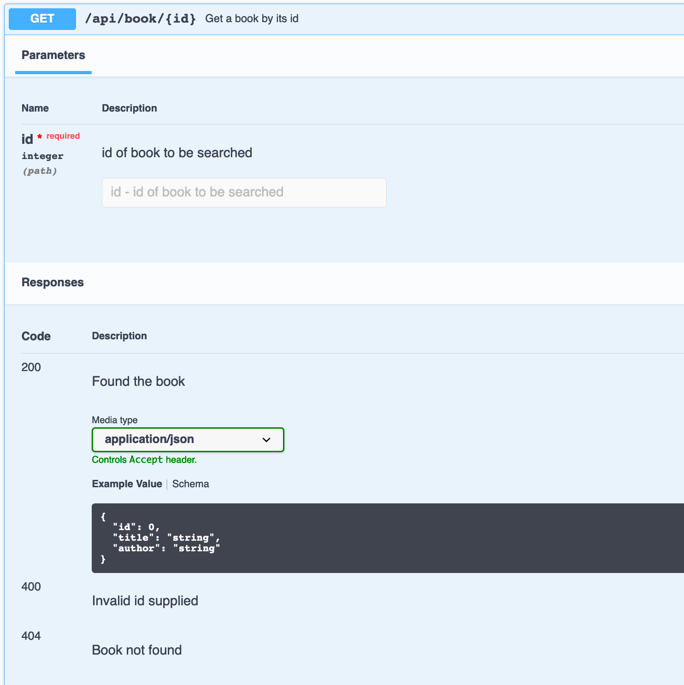
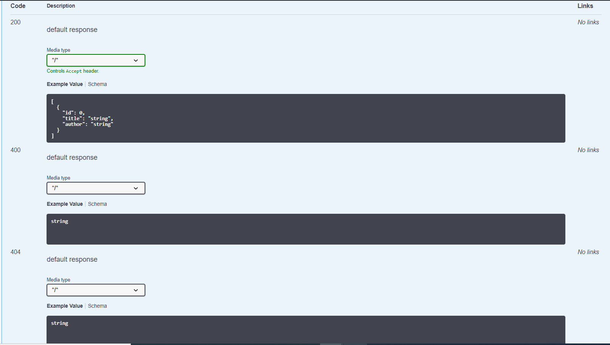

https://springdoc.org/#Introduction
https://springdoc.cn/spring-rest-openapi-documentation/


SpringDoc OpenAPI : springboot 3的版本，建议使用Springdoc-openapi-starter-webmvc-ui

SpringDoc是一款可以结合SpringBoot使用的API文档生成工具，基于`OpenAPI 3`，目前在Github上已有`1.7K+Star`，更新发版还是挺勤快的，是一款更好用的Swagger库！值得一提的是SpringDoc不仅支持Spring WebMvc项目，还可以支持Spring WebFlux项目，甚至Spring Rest和Spring Native项目，总之非常强大，下面是一张SpringDoc的架构图。


# 1 集成

Springtboot 3.x 
```xml
<dependency>
    <groupId>org.springdoc</groupId>
    <artifactId>springdoc-openapi-starter-webmvc-ui</artifactId>
    <version>2.7.0</version>
</dependency>
```


Springboot 2.x 
```xml
<!--springdoc 官方Starter--> 
<dependency> 
    <groupId>org.springdoc</groupId> 
    <artifactId>springdoc-openapi-ui</artifactId> 
    <version>1.6.6</version> 
</dependency>
```


# 2 swagger-UI

访问
```
http://localhost:8080/api-docs
http://localhost:8080/swagger-ui/index.html
```


# 3 注解

## 3.1 Controller 注解

- @Tag 用来设置 Controller 的名称和描述，类似于给 Postman 的 Collections 命名；
- @ApiResponses 和 @ApiResponse 用来配置响应；
- @Operation 用来设置接口名称和描述；
- @Parameter 用来设置请求参数的描述、是否必填和示例。


```java
@RestController
// 响应的 MediaType 都是 application/json
@RequestMapping(path = "/process-definition", produces = "application/json")

// Tag 注解, 给整个接口起了个名字 "流程定义", 描述是 "流程定义 API"
@Tag(name = "流程定义", description = "流程定义 API")

// ApiResponses 给每个接口提供一个默认的响应, 状态码是 200, 描述是 "接口请求成功"
@ApiResponses(@ApiResponse(responseCode = "200", description = "接口请求成功"))
public class ProcessDefinitionController {

    // Operation 注解设置了接口名称, 接口描述
    @Operation(summary = "上传 BPMN xml 字符串 并部署", description = "此接口处理的是 xml 字符串")
    @PostMapping("/upload-and-deploy/bpmn-xml-str")
    public JsonResult<?> uploadAndDeployBpmnXmlStr(@RequestBody BpmnXmlReq req) {
        return JsonResult.of(CommonCodeEnum.OK);
    }

    @Operation(summary = "查询单个 bpmn xml 数据")
    @GetMapping("/bpmn-xml")
    public JsonResult<BpmnXmlResp> findBpmnXml(
            // Parameter 注解设置了请求参数的描述, 是否必填 以及示例
            @Parameter(description = "流程部署ID", required = true, example = "1234") String deployId,
            @Parameter(description = "流程资源名称", required = true, example = "xxx.bpmn") String resourceName) {
        return JsonResult.of(CommonCodeEnum.OK, new BpmnXmlResp());
    }
}
```


```java
@PostMapping
@ApiResponses(value = {

    @ApiResponse(responseCode = "200", description = "Results are ok", 
        content = { 
            @Content(mediaType = "application/json", schema = @Schema(implementation = DemoResponseEntity.class)
            ) 
        }
    ),
    
    @ApiResponse(responseCode = "400", description = "Invalid request", content = @Content),
    
    @ApiResponse(responseCode = "404", description = "resource not found",
                    content = @Content) 
}
)

@Operation(summary = "Springdoc open api sample API")
public ResponseEntity postApiCall(@RequestBody RequestEntity request){
    System.out.println("Checking swagger doc ");
    return new ResponseEntity(HttpStatus.OK);
}
```


```java
@Operation(summary = "Get a book by its id")
@ApiResponses(value = { 
  @ApiResponse(responseCode = "200", description = "Found the book", 
    content = { @Content(mediaType = "application/json", 
      schema = @Schema(implementation = Book.class)) }),
  @ApiResponse(responseCode = "400", description = "Invalid id supplied", 
    content = @Content), 
  @ApiResponse(responseCode = "404", description = "Book not found", 
    content = @Content) })
@GetMapping("/{id}")
public Book findById(@Parameter(description = "id of book to be searched") 
  @PathVariable long id) {
    return repository.findById(id).orElseThrow(() -> new BookNotFoundException());
}
```

我们可以看到，我们添加到 `@Operation` 中的文本被置于 API 操作层。同样，在 `@ApiResponses` 容器注解中添加到各种 `@ApiResponse` 元素中的说明也在这里可见，从而为我们的 API 响应增添了意义。
我们没有为上述 `400` 和 `404` 响应定义任何 schema。由于我们为它们定义了一个空 `@Content`，因此只显示了它们的描述。



### 3.1.1 使用 @ControllerAdvice 和 @ResponseStatus 生成文档

在 `@RestControllerAdvice` 类中的方法上使用 `@ResponseStatus` 会自动为 response code 生成文档。在这个 `@RestControllerAdvice` 类中，两个方法都注解了 `@ResponseStatus`：

```java
@RestControllerAdvice
public class GlobalControllerExceptionHandler {

    @ExceptionHandler(ConversionFailedException.class)
    @ResponseStatus(HttpStatus.BAD_REQUEST)
    public ResponseEntity<String> handleConversion(RuntimeException ex) {
        return new ResponseEntity<>(ex.getMessage(), HttpStatus.BAD_REQUEST);
    }
    
    @ExceptionHandler(BookNotFoundException.class)
    @ResponseStatus(HttpStatus.NOT_FOUND)
    public ResponseEntity<String> handleBookNotFound(RuntimeException ex) {
        return new ResponseEntity<>(ex.getMessage(), HttpStatus.NOT_FOUND);
    }
}
```




因此，我们现在可以看到 response code `400` 和 `404` 的文档：


## 3.2 Model 注解
```java
@Data
// Schema 注解设置这个类的描述
@Schema(description = "bpmn xml 请求参数")
public class BpmnXmlReq {
    // Schema 注解设置每个属性的描述和示例
    @Schema(description = "bpmn文件的内容, 字符串格式", example = "<?xml version=\"1.0\" encoding=\"UTF-8\"?>")
    private String xml;
    @Schema(description = "流程部署名称", example = "请假流程")
    private String deployName;
}


@Schema(description = "json结构的响应")
public class JsonResult<T> {
    @Schema(description = "状态码", example = "200")
    private Integer code;
    @Schema(description = "状态码对应的信息", example = "请求成功")
    private String message;
    @Schema(description = "给前端返回的 json 格式的内容")
    private T content;
    // 省略部分内容
}
```

We can use @NotBlank annotation to mark the field as required and we can use @Size annotation to define the minimum and maximum length of the field.
当我们的 model 包含 JSR-303 Bean 验证注解（如 @NotNull、@NotBlank、@Size、@Min 和 @Max）时，springdoc-openapi 库会使用它们为相应的约束生成额外的 schema 文档。

```java
public class Book {

    private long id;

    @NotBlank
    @Size(min = 0, max = 20)
    private String title;

    @NotBlank
    @Size(min = 0, max = 30)
    private String author;

}
```


## 3.3 上传文件
```java
@Operation(summary = "上传 BPMN 文件并部署", description = "此接口处理的是文件流")
@PostMapping(path = "/upload-and-deploy/bpmn-file", consumes = MediaType.MULTIPART_FORM_DATA_VALUE)
public JsonResult<DeploymentResp> uploadAndDeployBpmnFile(
        @Parameter(description = "要上传的 BPMN 文件", required = true) MultipartFile file,
        @Parameter(description = "流程部署的名称", required = true) @RequestParam String deployName) {
    return processDefinitionService.uploadAndDeployBpmnFile(file, deployName);
}
```


# 4 配置项

## 4.1 appplication.properties

- springdoc.api-docs.path=/api-docs  
- springdoc.swagger-ui.path=/swagger-ui.html
- `springdoc.swagger-ui.tagsSorter` 给 API 排序， 如果其值为 `alpha` 就表示按字母顺序排序。默认情况下（也就是不配置此项），API 的顺序由 swagger 自己决定（也就是没什么顺序）；
- `springdoc.swagger-ui.operationsSorter` 给 HTTP 方法排序，其值为 `alpha` 同样表示按字母顺序排序，值为 `method` 表示根据 HTTP 请求的类型（顺序如下：DELETE > GET > POST > PUT）排序。默认情况下，Controller 代码里面，你写的是什么顺序，swagger 就给你展示什么顺序。


## 4.2 Configuration class 

SpringDocConfig.java


### 4.2.1 分组功能 

```java
package com.example.blog_system_1.config;

import io.swagger.v3.oas.annotations.ExternalDocumentation;
import io.swagger.v3.oas.annotations.info.Info;
import io.swagger.v3.oas.annotations.info.License;
import io.swagger.v3.oas.models.OpenAPI;
import io.swagger.v3.oas.models.info.*;
import org.springdoc.core.models.GroupedOpenApi;
import org.springframework.context.annotation.Bean;
import org.springframework.context.annotation.Configuration;

@Configuration
public class SpringDocConfig {
    
    @Bean
    public GroupedOpenApi publicApi() {
        return GroupedOpenApi.builder()
                .group("brand")
                .pathsToMatch("/brand/**")
                .build();
    }
    @Bean
    public GroupedOpenApi userApi() {
        return GroupedOpenApi.builder()
                .group("user")
                .pathsToMatch("/user/**")
                .build();
    }

    @Bean
    public GroupedOpenApi allApi() {
        return GroupedOpenApi.builder()
                .group("all")
                .pathsToMatch("/**")
                .build();
    }

}

```