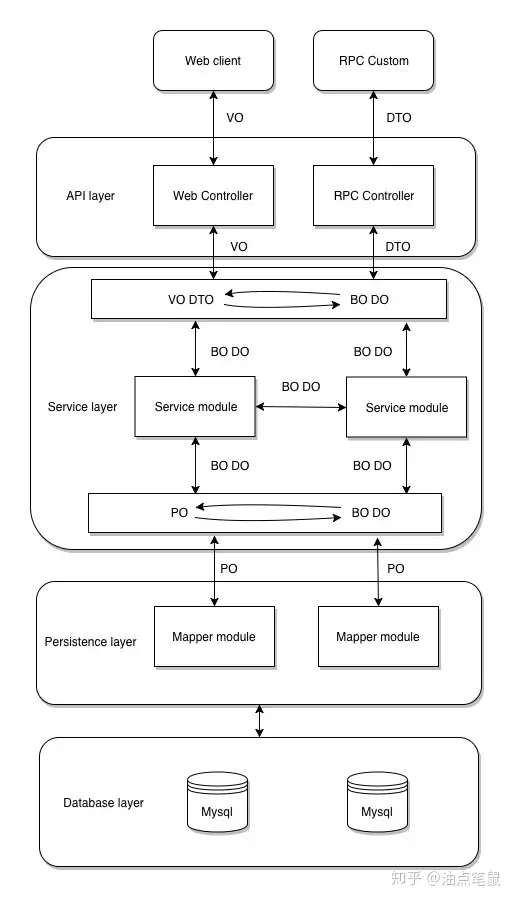
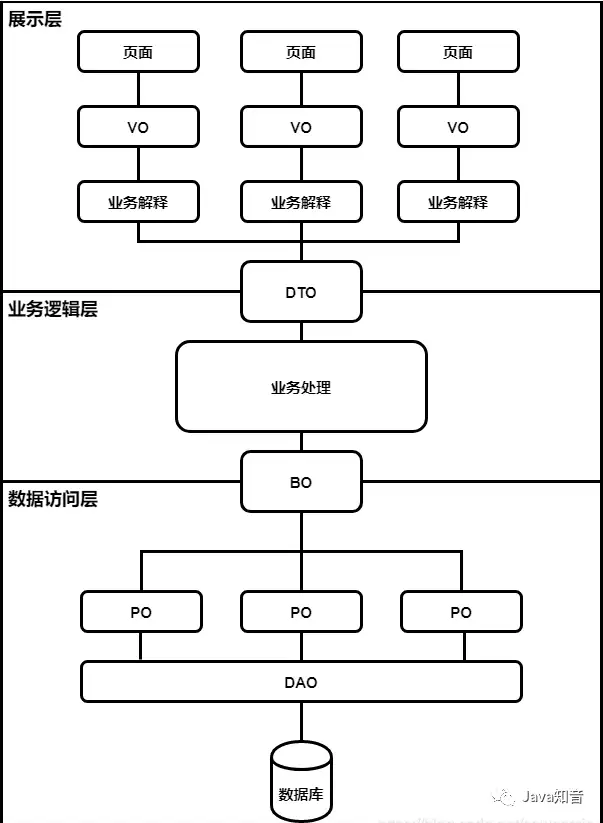

https://www.zhihu.com/question/39651928


# 1 总括 

Controller-->serviceInterace-->serviceImpl-->dao--->db -> dto -> vo -> frontend 

Controller层调用Service层的方法，Service层调用Dao层中的方法，其中调用的参数是使用Entity层进行传递的。

model层
- entity层即数据库实体层，也被称为entity层，pojo层。
- 一般数据库一张表对应一个实体类，类属性同表字段一一对应。

dao层
- DAO层叫数据访问层_，全称为data access object，属于一种比较底层，比较基础的操作，具体到对于某个表的增删改查，也就是说某个DAO一定是和数据库的某一张表
- dao层即数据持久层，也被称为mapper层。
- dao层的作用为访问数据库，向数据库发送sql语句，完成数据的增删改查任务。
- DAO层=mapper层，现在用Mybatis逆向工程生成的mapper层，其实就是dao层。DAO层会调用entity层，DAO中会定义实际使用到的方法，比如增删改查。DAO 层的数据源和数据库连接的参数都是在配置文件中进行配置的，配置文件一般在同层的XML文件夹中。数据持久化操作就是指，把数据放到持久化的介质中，同时提供增删改查操作。

service层
- service层即业务逻辑层。
- service层的作用为完成功能设计。
- service层调用dao层接口，接收dao层返回的数据，完成项目的基本功能设计。
- Service层主要负责业务模块的逻辑应用设计。先设计放接口的类，再创建实现的类，然后在配置文件中进行配置其实现的关联。service层调用dao层接口，接收dao层返回的数据，完成项目的基本功能设计。 
- 封装Service层的业务逻辑有利于业务逻辑的独立性和重复利用性

controller层
- controller层即控制层。
- controller层的功能为请求和响应控制。
- controller层负责前后端交互，接受前端请求，调用service层，接收service层返回的数据，最后返回具体的页面和数据到客户端。
- Controller层像是一个服务员，他把客人（前端）点的菜（数据、请求的类型等）进行汇总什么口味、咸淡、量的多少，交给厨师长（Service层），厨师长则告诉沾板厨师（Dao 1）、汤料房（Dao 2）、配菜厨师（Dao 3）等（统称Dao层）我需要什么样的半成品，副厨们（Dao层）就负责完成厨师长（Service）交代的任务。

---


不同类型的对象在架构设计中用于不同的用途，如下的分层架构表示了各个 POJO 的用途。为什么要在分层架构中，定义这些 POJO 对象呢？主要是为了确保各个分层能够很好地封装自己的服务，有效地控制信息的传播。







- Database Layer
- Entity Layer/Model Layer/ Repository
    - **PO 是** [Persistant Object](https://zhida.zhihu.com/search?content_id=97313791&content_type=Answer&match_order=1&q=Persistant+Object&zhida_source=entity) 的缩写，用于表示数据库中的一条记录映射成的 java 对象。
        - 一个table 就有一个 对应的java class. 这个class生成的一个instance就是一个PO
        - PO 仅仅用于表示数据，没有任何数据操作。通常遵守 Java Bean 的规范，拥有 getter/setter 方法。
- Persisentence Layer
    - **DAO 是** [Data Access Object](https://zhida.zhihu.com/search?content_id=97313791&content_type=Answer&match_order=1&q=Data+Access+Object&zhida_source=entity) 的缩写，用于表示一个数据访问对象。
        - 使用 DAO 访问数据库，包括插入、更新、删除、查询等操作，与 PO 一起使用。
        - DAO 一般在持久层，完全封装数据库操作，对外暴露的方法使得上层应用不需要关注数据库相关的任何信息。
        - 一个Dao 中定义一个 java class with name xxxDao
        - DAO是Data Access Object数据访问接口，数据访问：顾名思义就是与数据库打交道。夹在业务逻辑与数据库资源中间。J2EE开发人员使用数据访问对象（DAO）设计模式把底层的数据访问逻辑和高层的商务逻辑分开.实现DAO模式能够更加专注于编写数据访问代码。DAO模式是标准的J2EE设计模式之一.开发人员使用这个模式把底层的数据访问操作和上层的商务逻辑分开
- Service Layer/ Business Layer
    - 一个service 文件中定义一个java class with name xxxService,  这个 class 生成的 object 就是一个 business object . 这个 BO  用作于 和其他module 之间的传输 
    - **BO 是** [Business Object](https://zhida.zhihu.com/search?content_id=97313791&content_type=Answer&match_order=1&q=Business+Object&zhida_source=entity) 的缩写，用于表示一个业务对象。业务对象，由 Service 层输出的封装业务逻辑的对象
        - BO 包括了业务逻辑，常常封装了对 DAO、RPC 等的调用，==可以进行 PO 与 VO/DTO 之间的转换==。BO 通常位于业务层，要区别于直接对外提供服务的服务层：BO 提供了基本业务单元的基本业务操作，在设计上属于被服务层业务流程调用的对象，一个业务流程可能需要调用多个 BO 来完成。
    - DO: **(Data Object)**:此对象与数据库表结构一一对应，通过 DAO 层向上传输数据源对象
- **DTO 是** [Data Transfer Object](https://zhida.zhihu.com/search?content_id=97313791&content_type=Answer&match_order=1&q=Data+Transfer+Object&zhida_source=entity) 的缩写，用于表示一个数据传输对象。
    - DTO（数据传输对象）用于**在不同的系统或层之间传输数据**，可以包含**少量业务逻辑**（如数据转换、校验）。DTO 主要用于**减少接口调用时的数据冗余**，提高**数据传输效率**。
    - 用途: **Controller 接收前端传来的数据**（前端 → Controller) ,   **Service 层之间的数据传输**（Controller → Service → Repository）, **避免暴露数据库实体（Entity）**
    - DTO 通常用于不同服务或服务不同分层之间的数据传输。DTO 与 VO 概念相似，并且通常情况下字段也基本一致。但 DTO 与 VO 又有一些不同，这个不同主要是设计理念上的，比如 API 服务需要使用的 DTO 就可能与 VO 存在差异。通常遵守 Java Bean 的规范，拥有 getter/setter 方法。
    - 主要用于远程调用等需要大量传输对象的地方。比如我们一张表有100个字段，那么对应的PO就有100个属性。但是我们界面上只要显示10个字段，客户端用WEB service来获取数据，没有必要把整个PO对象传递到客户端，这时我们就可以用只有这10个属性的DTO来传递结果到客户端，这样也不会暴露服务端表结构。到达客户端以后，如果用这个对象来对应界面显示，那此时它的身份就转为VO。
- Controller Layer , API Layer 
    - 定义 RestAPI , 调用 service
- VO Value Object : **Controller 返回给前端的数据**（Controller → 前端）
    - VO（值对象）主要用于**表示业务逻辑中的数据**，通常是**只读**的对象，不包含业务逻辑，常用于**返回给前端的数据**。
    - **多个 DTO 组合成 VO（如订单详情页，包含用户信息、订单信息等）**
    - VO一般用作展示，而不用做前端 WEB 页面调用后端的是传数据。DTO 一般是前端和后端以各种方式传递数据。
    - **VO 是** [Value Object](https://zhida.zhihu.com/search?content_id=97313791&content_type=Answer&match_order=1&q=Value+Object&zhida_source=entity) 的缩写，用于表示一个与前端进行交互的 java 对象。
        - 显示层对象，通常是 Web 向模板渲染引擎层传输的对象。
        - 有的朋友也许有疑问，这里可不可以使用 PO 传递数据？实际上，这里的 VO 只包含前端需要展示的数据即可，对于前端不需要的数据，比如数据创建和修改的时间等字段，出于减少传输数据量大小和保护数据库结构不外泄的目的，不应该在 VO 中体现出来。通常遵守 Java Bean 的规范，拥有 getter/setter 方法。
        - 通常用于业务层之间的数据传递，和PO一样也是仅仅包含数据而已。但应是抽象出的业务对象,可以和表对应,也可以不,这根据业务的需要。PO只能用在数据层，VO用在商业逻辑层和表示层。各层操作属于该层自己的数据对象，这样就可以降低各层之间的耦合，便于以后系统的维护和扩展


# 2 POJO 

因为PO DTO VO  都叫是POJO，就是个简单的java对象；**POJO 是** Plain Ordinary Java Object 的缩写，表示一个简单 java 对象。上面说的 PO、VO、DTO 都是典型的 POJO。而 DAO、BO 一般都不是 POJO，只提供一些调用方法。

BO:  一个 service ,  提供一些 调用方法 
[DAO](https://zhida.zhihu.com/search?content_id=30448308&content_type=Answer&match_order=1&q=DAO&zhida_source=entity) 的话就是进行数据库增删改查的类。


# 3 DAO  Data Access Object

下面来说一下DAO，DAO一般在刚学MVC的时候会涉及到，[Data Access Object](https://zhida.zhihu.com/search?content_id=482914172&content_type=Answer&match_order=1&q=Data+Access+Object&zhida_source=entity)，数据访问对象，他就是用来访问数据库的对象，我们一般就会在这里面写上很多查询数据库的方法。

**比如UserDAO【User的CRUD操作】，一般增删改查会有五个方法：**

1. **条件分页查询**
2. **按照批量Id【也可以传单个】删除**
3. **新增**
4. **按照Id查询某一条的数据【修改时候数据前端回显】**
5. **修改接口**


```text
interface/class UserDAO {

    public List<UserVO> queryUserByCondition(UserDTO dto,PageCondition page);
    
    public User getUserById(Long userId);
    
    public int deletedUserByBatchIds(List<Long> userIds);
    
    public int editUser(UserEditDTO dto);
    
    public int addUser(UserAddDTO dto);

}
```

如果看到这里都没问题，那么有些靓仔可能又有问题了，你这UserDAO为啥类型又写interface又写class啊？

这个其实是接口的一种思想，如果你把查询数据库的代码【假如是JDBC逻辑，不用持久层框架哈】，那么这个UserDAO会变得很大，如果别人想来看一下你这个UserDAO里面到底有什么方法的时候，别人就会看着很头疼。

**所以我们一般把UserDAO写成一个接口，里面定义UserDAO操作数据库的方法的规范，然后会有一个类UserDAOImpl去实现UserDAO接口，然后在Impl类中写上真正操作数据库的代码。这样别人想了解UserDAO到底提供了哪些功能的时候，可以，看接口即可。想看功能到底怎么实现的时候，也可以，看Impl实现类的业务逻辑即可。**

DAO其实就是用来操作数据库的，封装所有对于数据库的数据CRUD操作，然后让业务层直接注入DAO对象，然后使用该方法即可。

不过在后面，我们更倾向于把DAO对象叫做Mapper【Map不是地图的意思，在后面开发中他更多的意思在于映射】，以后就不叫UserDAO了，我们一般叫UserMapper【mapper的意思和dao一样】，UserMapper就是表示用于封装数据库操作的一个映射对象，可以这样理解吧，不过mapper的意思和DAO八九不离十，后面开发中就是一个概念了。【**下文中就把DAO称为Mapper了**】


---

那么这时候又有靓仔想问了，假如我有很多表，User，Dept，SysJob【系统任务表】，SysLog【系统日志表】，SysDict【系统字典表】等等很多表，每一张表我都想提供基本的CRUD功能。

那么我难道要把上面五个逻辑几乎一样的CRUD方法还要在每一个XXXMapper中写一次吗？

比如UserMapper，DeptMapper，SysJobMapper，SysLogMapper，SysDictMapper，我每一个Mapper都要去写通用的五个CRUD逻辑吗？显然是太冗余了，那我能不能抽出一个公用的BaseMapper，来封装单表的CRUD操作呢？

```text
public interface UserMapper extends BaseMapper<User>
```

我们就可以在Mapper层写0代码，直接快速完成对于user单表的CRUD了，包括单表的各种复杂查询，直接0SQL开发【就是不用写一句SQL】，快不快？


# 4 PO Persistent Object 


**就比如说我用一个实际场景举例子吧，你更好懂，假如有一张user表，里面有几个字段：**

|user_id|user_name|pass_word|create_time|dept_id|
|---|---|---|---|---|

设就这么多吧，一张很基础的表，那么对应Java的写法就是一个类：
```text
class User{
    private Long userId;
    private String userName;
    private String passWord;
    private LocalDateTime createTime；
    private Long deptId;
    //getter setter constrcutor.....【可以用lombok，随意，我这里就省略了】
}
```

那么我现在需要对于User这张表进行增删改查，那么如果我假设你学过[Mybatis](https://zhida.zhihu.com/search?content_id=482914172&content_type=Answer&match_order=1&q=Mybatis&zhida_source=entity)?还是JPA这种持久层框架的话，或者你只要学过[JDBC](https://zhida.zhihu.com/search?content_id=482914172&content_type=Answer&match_order=1&q=JDBC&zhida_source=entity)的话，你就应该知道，Java中肯定需要一个对象来映射数据库的这张表。User类的每个属性就是数据库表的每一个字段，该类的每一个对象就代表数据库中的每一行，`List<User`>就代表该表的所有记录。

这个User类就被称为PO，一般也不会加PO的说法，这个类一般就是User。


# 5 BO Business Object 

BO就是Business Object了，业务对象，这个就不用怎么解释了，就是封装了业务逻辑的对象，一般开发中，BO估计就是代指Service层吧？业务层对象，MVC的设计模式一般是前端请求，来到后端的Controller【Provider】控制器层，控制器做一些最基本的校验【比如身份校验，入参校验，日志AOP等等】，然后分发请求到相应的业务层【也就是Service组件】来做处理。


业务层对于请求进行业务处理，如果要涉及到和数据库交互的，就是用Mapper【也就是DAO】层对象和数据库交互即可，大概就是这样一个逻辑。按照这样来说，Service层对象，比如User Service，应该算BO对象吧


# 6 BO和PO对比

PO是持久对象，这个很好理解，就是实体和数据库字段的对应，一个PO的数据结构对应着库中表的结构，表中的一条记录就是一个PO属性，大多数情况下，PO仅仅作为PO只是用来增删改使用。

PO比较容易混淆的是BO，BO是业务对象，对应的是某个具体的业务块，可以包含多个属性、对象。简单点来说，我们可以把BO看作是PO的组合

**我们举例来说明一下：**

PO-1是交易记录对象，PO-2是登录记录对象，PO-3是商品浏览记录对象，PO-4是添加购物车记录对象，PO-5是搜索记录对象，BO是个人网站行为对象，BO对象：{PO-1;PO-2;PO-3;PO-4;PO-5}。这样做的优点不言而喻，维护代码的时候查看BO，就能知道这块逻辑涉及多少表（PO）

搞清楚了BO和PO各自的用途后，我们会发现BO和DTO有重叠功能，一样可以对PO进行排列组合，那BO的存在的意义是什么呢？

从用途上进行根本的区别，BO是业务对象，DTO是数据传输对象，虽然BO也可以排列组合数据，但它的功能是对内的，比如上个例子中的BO对象包括{PO-1;PO-2;PO-3;PO-4;PO-5}还有其他字段属性，但在提供对外接口时，BO对象中的某些属性对象可能用不到或者不方便对外暴露，那么此时DTO只需要在BO的基础上，抽取自己需要的数据，然后对外提供。

在这个关系上，通常不会有数据内容的变化，内容变化要么在BO内部业务计算的时候完成，要么在解释VO的时候完成。


# 7 DTO  Data Transfer Object


DTO（数据传输对象）用于**在不同的系统或层之间传输数据**，可以包含**少量业务逻辑**（如数据转换、校验）。DTO 主要用于**减少接口调用时的数据冗余**，提高**数据传输效率**。
- 用途: **Controller 接收前端传来的数据**（前端 → Controller) ,   **Service 层之间的数据传输**（Controller → Service → Repository）
- **避免暴露数据库实体（Entity）**

- **用于传输数据**：DTO 主要用于**Service 层和 Controller 层之间的数据交互**。  
- **可以包含简单的校验逻辑**（例如 `@NotNull`、`@Size`）  
- **通常是可变的（Mutable）**：因为 DTO 可能会在不同的层修改数据。  
- **和数据库模型（Entity）不同**：DTO 通常是**定制化的**，只包含需要传输的字段。


```java
import jakarta.validation.constraints.NotNull;
import jakarta.validation.constraints.Size;

public class UserDTO {
    @NotNull(message = "ID 不能为空")
    private Long id;

    @Size(min = 3, max = 50, message = "用户名长度必须在 3-50 之间")
    private String name;

    @NotNull(message = "Email 不能为空")
    private String email;

    public UserDTO() {} // 默认构造函数

    public UserDTO(Long id, String name, String email) {
        this.id = id;
        this.name = name;
        this.email = email;
    }

    // Getter 和 Setter
    public Long getId() { return id; }
    public void setId(Long id) { this.id = id; }

    public String getName() { return name; }
    public void setName(String name) { this.name = name; }

    public String getEmail() { return email; }
    public void setEmail(String email) { this.email = email; }
}

```


---


比如，User这张表，一般在前端我们会进行分页+条件查询，然后在前端用一个列表组件，对于后端请求过来的数据做渲染。对于CRUD来说，这也是一个基本的需求。

那么假设现在有这样一个情况：假设我们再简化一下情况，我们只做条件查询，我需要按照用户名userName模糊匹配，用户创建时间createTime区间匹配的时候，我后端应该如何写？

或者换言之，**我后端应该用一个什么对象来接收前端传过来的请求参数？**

**这时候我们来想想，User类对象，他还能胜任吗？userName还好说，那create Time的区间怎么表示呢？**

显然这时候我们就不能在后端这样写了：

```text
public XXX【返回值】 selectUserByCondidition(@RequestBody @Validated User user);
```

光靠一个User对象我们是不足以接收前端传过来的请求参数的，那你说我可以这样啊：

```text
public XXX【返回值】 selectUserByCondidition(String userName,
LocalDateTime startTime,
LocalDateTime endTime)
```

。。。。。

这还只是两个字段的条件，如果字段一但多起来了，你确定这样写？你确定老板看了以后不会让你当场毕业？


---


所以这时候我们就要用到DTO了，数据传输对象，用于在网络中涉及到数据传输的封装对象。那么此时我们就可以在后端定义这样一个DTO：**UserQueryConditionDTO【用户条件查询DTO】**

```text
public class UserQueryConditionDTO{
private String userName;
private LocalDateTime startTime;
private LocalDateTime endTime;
//getter setter validation_annotation constrcutor【这些答主就不写了】 .... 
}
```

然后我们后端接口就可以这样写：

```text
public XXX【返回值】 selectUserByCondidition(@RequestBody @Validated UserQueryConditionDTO dto);
```

简单明了，别人一看代码，点进去一看，你再给字段打上备注，一下就清晰了。这就是DTO的用处。


# 8 VO View Object

  - VO（值对象）主要用于**表示业务逻辑中的数据**，通常是**只读**的对象，不包含业务逻辑，常用于**返回给前端的数据**。
        - **不可变性（Immutable）**：VO 通常不应该被修改，一旦创建，值就不会改变。  
        - **无业务逻辑**：只用于数据展示，不包含复杂的业务逻辑。  
        - **用于前端展示**：一般用于**Controller 层**，封装**返回给前端的数据**。  
        - **可以包含多个 DTO 或 POJO**：VO 可以是多个 DTO 组合而成的封装对象。


```java
public class UserVO {
    private Long id;
    private String name;
    private String email;

    public UserVO(Long id, String name, String email) {
        this.id = id;
        this.name = name;
        this.email = email;
    }

    // 只提供 Getter，没有 Setter，保证不可变性
    public Long getId() { return id; }
    public String getName() { return name; }
    public String getEmail() { return email; }
}

```


---


下面来说VO的用处：VO意思就是View Object，View这个单词学过[MVC](https://zhida.zhihu.com/search?content_id=482914172&content_type=Answer&match_order=1&q=MVC&zhida_source=entity)思想的都知道，【都能看到这个问题了，不会还有人MVC都不知道吧】，叫视图层，**那么View Object呢？顾名思义，那就是返回给视图层【前端】需要用到的对象。**

**这时候又有人不懂了，返回给前端我需要啥VO啊，什么意思？还是用这个User举例子。**

我通过刚才的DTO，然后通过一系列JDBC操作，我查询到了`List<User>`列表，里面就包含每一个用户的完整信息【用户Id，用户名，密码，部门Id，创建时间】，也就是上面表的五个字段。

**但是你准备就把这个`List<User>`返给前端吗？？前端展示的用户所属部门，至少是展示部门名吧？怎么可能直接在前端列表去展示每个用户的所属部门Id呢？**

**不会吧，不会真有兄弟给前端说，你获取到`List<User>`这个数组以后，你对于每一个dept_Id再分别发请求，我给一个接口，你给我dept_Id，我给你返回dept_Name，不就完了吗。你确定前端兄弟不想打屎你？这样的网络IO有考虑过吗，数据量多了一个页面都是几十个请求到时候，这样是肯定不行的。**

那部门名去哪里找呢？那肯定有一张部门表咯，这不就是表的关联关系吗，一般来说，最简单的情况下，都是通过Id关联，假设有一张部门表dept：

|Id|dept_name|create_time|deleted|
|---|---|---|---|

Id就是部门的Id，和User表的dept_id有映射关系，deleted就是逻辑删除，create_time和dept_name就不多说了。逻辑删除不懂的请自行百度或谷歌。

**大概提一下，逻辑删除就是当前端删除该数据的时候，用这个标识字段来表示该数据的删除情况，假设0就是未删除，1就是已删除。在任意查询的时候我们也会避开逻辑删除字段为1的数据。**


---


那么此时我们就应该用关联来查询出用户的所属部门名了：SQL伪代码，看懂意思就行

```mysql
select 
  u表的所有数据,d.dept_name
from user u 
left join dept d 
on u.dept_id = d.Id

//后面你排不排序啥的我也不管了，这里自行按照业务逻辑添加
```

**那么此时，我们通过该SQL返回的数据还能用User对象接收吗？**

**当然就不行了，因为User对象没有DeptName这个属性，但现在我们需要一个对象封装带有deptName属性的user。**

**那么我们考虑该对象是需要发送给前端来展示的，也就是视图层，所以我们就需要一个对象，来传输给视图层，那么，就是我们的VO了。UserVO来返回给前端。**

```java
class UserVO{
   Long userId;
   String userName;
   String deptName;
   String password;
   Long deptId;
   LocalDateTime createTime;
//Getter  Setter etc ...
}
```

这就是VO的用处


# 9 **VO 和 DTO 的对比**

|对比项|VO（Value Object）|DTO（Data Transfer Object）|
|---|---|---|
|**作用**|表示值对象，用于数据展示|传输数据，减少数据冗余|
|**使用场景**|**Controller → 前端**|**前端 → Controller → Service**|
|**是否可变**|**不可变（Immutable）**|**可变（Mutable）**|
|**包含业务逻辑**|❌ 不包含业务逻辑|✅ 可以包含校验逻辑|
|**数据来源**|**DTO 或多个 POJO 组合**|**数据库 Entity 转换而来**|
|**是否用于数据库**|❌ 不是数据库表的直接映射|❌ 不是数据库表的直接映射|


首先VO是最常用的，但对于这个概念，网上也是众说纷纭，value object 或 view object，一般说视图对象或者值对象，我更倾向理解为视图对象。说白了它就是展示用的，不管展示方式是网页，还是客户端，还是APP，只要是这个东西是让人看到的，我们就把它封装为VO。

VO比较容易混淆的是DTO，DTO是展示层与服务层之间传递数据的对象，可以这样说，对于绝大部分的应用场景来说，DTO和VO的属性值基本是一致的，而且他们通常都是POJO，那么既然有了VO，为什么还需要DTO呢？

**我们举例来说明一下：**

某公司有一个后台服务，服务层有一个getUser的方法返回一个系统用户，包含sex(性别)、年龄。对于服务层来说，DTO只从语义上定义，可能是这样的：

```text
{
 "gender":"男",
 "age":35
}
```

但这个服务同时供多个客户端使用（不同门户），而不同的客户端对于表现层的要求有所不同，比如管理端要求显示准确的年龄，而应用端为了保护客户隐私，只需要显示一个年龄段即可。

管理端VO：

```text
{
 "gender":"男",
 "age":35
}
```

应用端VO：

```text
{
 "gender":"男",
 "age":30~40
}
```

从这个例子可以看出，DTO很有存在的必要，根据职责单一原则，服务层只负责业务，与具体的表现形式无关，DTO不应该出现与表现形式的耦合，DTO定义的是原始数据，VO再对DTO数据进行解释。这下VO和DTO用法就清晰很多了。


# 10 DO Data Object , TO Transfer Object


DO，Data Object，数据对象，这概念吧，其实有是有，但是用的，我个人感觉不多，有一种情况就是微服务之间互相传输对象数据的时候，我们就会将该数据抽取出来。

比如商品下单以后，大量的JSON数据会传输到后台，我们会在后台调用很多模块，比如OMS/订单管理模块，又或是ERP模块，又或是WMS/库存物流模块，等等等等，会调用很多其他微服务模块。不同服务之间传输对象，要不然就将对象定义为DO【或者TO，不同叫法而已，Transfer Object或者Data Object】，然后两个模块之间RPC调用，传输的对象要被两个模块共享，要不然就将每一个模块涉及的各种实体对象单独抽出来放在一个entities模块下啊，要不然就是将这些微服务模块之间的交互传输对象定义在Common模块中，作为DO或者TO，来进行微服务之间的数据传输所用


# 11 例子 


## 11.1 VO 和 DTO 的例子 

- **VO（值对象）** → **用于返回前端的数据**（不可变，仅用于展示）
- **DTO（数据传输对象）** → **用于接收请求和传输数据**（可变，可包含校验）
- **Entity（实体类）** → **数据库映射对象，不直接暴露给前端**
- **Service 层** 负责 **DTO → Entity → 存储**，然后 **Entity → VO → 返回**

用于接收请求

Get Post Request From FrontEND   -> 
 1 Write data into Database) -> Controller ( Data in RequestBoady insert into A DTO) ->   call  a service with DTO -> service call  a mappser/DAO with the data of DTO-> in DAO: write data into Database (A PO is generated , po is based on a entity class .  Mybatis is used )
2 as Response to Frontend 返回新产生的项目的所有的attribute 和他的值  ->   call  another  service with DTO -> service call DAO with the data of DTO to get a entry which was generated before -> use the returned value of DAO to generate new DTO ->  use DTO to generate a VO -> controller return the VO to Frontend 

1 VO 
**返回给前端的数据**（Controller → 前端）

```java
public class UserVO {
    private String name;
    private String email;

    public UserVO(String name, String email) {
        this.name = name;
        this.email = email;
    }
}

```

2 DTO
DTO（数据传输对象）用于在不同的系统或层之间传输数据，可以包含少量业务逻辑（如数据转换、校验）。DTO 主要用于减少接口调用时的数据冗余，提高数据传输效率。

```java
public class UserDTO {
    private String name;
    private String email;
}

```


3 Entity
```java
import jakarta.persistence.*;

@Entity
@Table(name = "users")
public class User {
    @Id
    @GeneratedValue(strategy = GenerationType.IDENTITY)
    private Long id;
    private String name;
    private String email;

    // Getter & Setter 省略
}

```

4 Service 层
```java
@Service
public class UserService {
    @Autowired
    private UserRepository userRepository;

    // DTO -> Entity
    public User saveUser(UserDTO userDTO) {
        User user = new User();
        user.setName(userDTO.getName());
        user.setEmail(userDTO.getEmail());
        return userRepository.save(user);
    }

    // Entity -> VO
    public UserVO getUserById(Long id) {
        User user = userRepository.findById(id).orElseThrow(() -> new RuntimeException("User not found"));
        return new UserVO(user.getName(), user.getEmail());
    }
}

```

5 Controller 层

```java
@RestController
@RequestMapping("/users")
public class UserController {
    @Autowired
    private UserService userService;

    // 接收前端数据（DTO）
    @PostMapping
    public ResponseEntity<UserVO> createUser(@RequestBody @Valid UserDTO userDTO) {
        User user = userService.saveUser(userDTO);
        return ResponseEntity.ok(new UserVO(user.getName(), user.getEmail()));
    }

    // 返回给前端（VO）
    @GetMapping("/{id}")
    public ResponseEntity<UserVO> getUser(@PathVariable Long id) {
        return ResponseEntity.ok(userService.getUserById(id));
    }
}

```