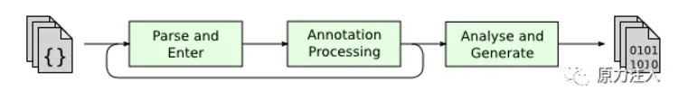
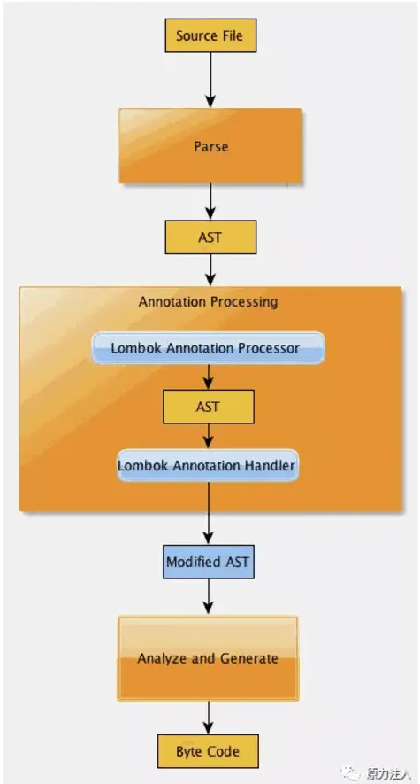

https://juejin.cn/post/6844903557016076302


视频: 
- [30分钟速通Lombok所有使用技巧和底层原理！让你明白它为何是项目神级插件 ](https://www.bilibili.com/video/BV1QH4y1y7ux/?spm_id_from=333.337.search-card.all.click&vd_source=55e5cc2f534c16c73bbeb684e98c4195)


# 1 配置 


```xml
<dependency> 
    <groupId>org.projectlombok</groupId> 
    <artifactId>lombok</artifactId> 
    <version>1.16.8</version> 
</dependency>

<dependency>  
    <groupId>org.projectlombok</groupId>  
    <artifactId>lombok</artifactId>  
    <scope>provided</scope>  
</dependency>
```


# 2 Lombok注解原理


说道 Lombok，我们就得去提到 JSR 269: Pluggable Annotation Processing API ([www.jcp.org/en/jsr/deta…](https://link.juejin.cn?target=https%3A%2F%2Fwww.jcp.org%2Fen%2Fjsr%2Fdetail%3Fid%3D269 "https://www.jcp.org/en/jsr/detail?id=269")) 。JSR 269 之前我们也有注解这样的神器，可是我们比如想要做什么必须使用反射，反射的方法局限性较大。**首先，它必须定义@Retention为RetentionPolicy.RUNTIME，只能在运行时通过反射来获取注解值，使得运行时代码效率降低**。其次，如果想在编译阶段利用注解来进行一些检查，对用户的某些不合理代码给出错误报告，反射的使用方法就无能为力了。**而 JSR 269 之后我们可以在 Javac的编译期利用注解做这些事情**。所以我们发现**核心的区分是在 运行期 还是 编译期**。

  


从上图可知，Annotation Processing 是在解析和生成之间的一个步骤。具体详细步骤如下：



上图是 Lombok 处理流程，**在Javac 解析成抽象语法树之后(AST), Lombok 根据自己的注解处理器，动态的修改 AST，增加新的节点(所谓代码)，最终通过分析和生成字节码**。


**自从Java 6起，javac就支持“JSR 269 Pluggable Annotation Processing API”规范，只要程序实现了该API，就能在javac运行的时候得到调用**。
- 常用的项目管理工具Maven所使用的java编译工具来源于配置的第三方工具，如果我们配置这个第三方工具为Oracle javac的话，那么Maven也就直接支持lombok了;
- Intellij Idea配置的编译工具为Oracle javac的话，也就直接支持lombok了;


# 3 注解


## 3.1 @val @var示例

- `val`：用在局部变量前面，相当于将变量声明为final
- var 定义的是 非 final 变量 

```java
public static void main(String[] args) {
    val sets = new HashSet<String>();
    val lists = new ArrayList<String>();
    val maps = new HashMap<String, String>();
    //=>相当于如下
    final Set<String> sets2 = new HashSet<>();
    final List<String> lists2 = new ArrayList<>();
    final Map<String, String> maps2 = new HashMap<>();
}


public class ValAndVarExample {
    public void example() {
        val example = "hello world";
        example = "hello china";// Cannot assign a value to final variable
    }

    public void example2() {
        var example =  "hello world";
        example =  "hello china";
    }

}
```


## 3.2 @NonNull示例

- `@NonNull`：给方法参数增加这个注解会自动在方法内对该参数进行是否为空的校验，如果为空，则抛出NPE（NullPointerException）

```java
public void notNullExample(@NonNull String string) {
    string.length();
}
//=>相当于
public void notNullExample(String string) {
    if (string != null) {
        string.length();
    } else {
        throw new NullPointerException("null");
    }
}
```


```java
public class NonNullExample {
    public void example(@NonNull String param){
        System.out.println(param);
    }

    public static void main(Sting[] args) {
        NonNullExample example  = new NonNullExample();
        example.example(null);
    }

}
```


## 3.3 @NonFinal

@NonFinal来标记某个属性不变成final
```java
public class ValueExample {
    String name;
    @NonFinal public int age;
    public double score;
}
```

## 3.4 @Cleanup示例

- `@Cleanup`：自动管理资源，用在局部变量之前，在当前变量范围内即将执行完毕退出之前会自动清理资源，自动生成try-finally这样的代码来关闭流
- 自动帮我们清理资源，比如InputStream、OutputStream,会自动的调用close方法。

```java
public static void main(String[] args) {
    try {
        @Cleanup InputStream inputStream = new FileInputStream(args[0]);
    } catch (FileNotFoundException e) {
        e.printStackTrace();
    }
    //=>相当于
    InputStream inputStream = null;
    try {
        inputStream = new FileInputStream(args[0]);
    } catch (FileNotFoundException e) {
        e.printStackTrace();
    } finally {
        if (inputStream != null) {
            try {
                inputStream.close();
            } catch (IOException e) {
                e.printStackTrace();
            }
        }
    }
}

```

---

```java
public class CleanupExample {

    public static void main(String[]args)throws IOException {
        @Cleanup Inputstream in new FileInputStream(args[0]);
        
        byte[]b new byte[1024];
        int.read(b)
    }
}

```

编译后 变成这样 


---

如果某个资源没有close方法，那么我们可以指定某个方法来关闭资源，value属性默认为close:

```java
@Target({ElementType.LOCAL VARIABLE})
@Retention(RetentionPolicy.SOURCE)

public @interface Cleanup {
    String value()default "close";
}
```
## 3.5 @Getter/@Setter示例

- `@Getter/@Setter`：用在属性上，再也不用自己手写setter和getter方法了，还可以指定访问范围, 默认的生辰该方法是 public , 可以通过 value属性来进行修改 

```java
@Setter(AccessLevel.PUBLIC)
@Getter(AccessLevel.PROTECTED)
private int id;
private String shap;
```


## 3.6 @ToString示例

- `@ToString`：用在类上，可以自动覆写toString方法，当然还可以加其他参数，例如@ToString(exclude=”id”)排除id属性，或者@ToString(callSuper=true, includeFieldNames=true)调用父类的toString方法，包含所有属性

```java
@ToString(exclude = "id", callSuper = true, includeFieldNames = true)
public class LombokDemo {
    private int id;
    private String name;
    private int age;
    public static void main(String[] args) {
        //输出LombokDemo(super=LombokDemo@48524010, name=null, age=0)
        System.out.println(new LombokDemo());
    }
}

```

复写的效果为
```java
public String tostring(){
    return "CommonExample(name="+this.getName()+",age="+this.getAge()
}
```


## 3.7 @EqualsAndHashCode示例

- `@EqualsAndHashCode`：用在类上，自动生成equals方法和hashCode方法. 效果雷思维重写 equals()方法与hashCode()方法
- 规定是 如果重写了 Equals 方法 就要去重写HashCode 方法

```java
@EqualsAndHashCode(exclude = {"id", "shape"}, callSuper = false)
public class LombokDemo {
    private int id;
    private String shap;
}

```

```java
@ToString
@Getter
@Setter
@EqualsAndHashCode
public class CommonExample {

    @ToString.Exclude private Integer id;
    private String name;
    private Integer age;
    @EqualsAndHashCode.Exclude private String grade;
    
    public static void main(Str ing[]args){
        CommonExample commonExample new CommonExample();
        commonExample.setAge(18)
        commonExample.setName("zhouyu");
        System.out.println(commonExample)
    }

}
```


编译后 代码为


 

## 3.8 @NoArgsConstructor, @RequiredArgsConstructor and @AllArgsConstructor示例


- `@NoArgsConstructor, @RequiredArgsConstructor and @AllArgsConstructor`：
    - 用在类上，自动生成无参构造和使用所有参数的构造函数(@NonNull 和 @NonNull 的参数 都包括 ) 以及把所有@NonNull属性作为参数的构造函数，
    -  如果@RequiredArgsConstructor指定staticName = “of”参数，同时还会生成一个返回类对象的静态工厂方法，比使用构造函数方便很多

```java
@NoArgsConstructor
@RequiredArgsConstructor(staticName = "of")
@AllArgsConstructor
public class LombokDemo {
    @NonNull
    private int id;
    @NonNull
    private String shap;
    private int age;
    public static void main(String[] args) {
        new LombokDemo(1, "circle");
        
        //使用静态工厂方法
        LombokDemo.of(2, "circle");
        
        //无参构造
        new LombokDemo();
        
        //包含所有参数
        new LombokDemo(1, "circle", 2);
    }
}

```


## 3.9 @Data示例


- `@Data`：注解在类上，相当于同时使用了`@ToString`、`@EqualsAndHashCode`、`@Getter`、`@Setter`和`@RequiredArgsConstrutor`这些注解，对于`POJO类`十分有用

```java
import lombok.Data;
@Data
public class Menu {
    private String shopId;
    private String skuMenuId;
    private String skuName;
    private String normalizeSkuName;
    private String dishMenuId;
    private String dishName;
    private String dishNum;
    //默认阈值
    private float thresHold = 0;
    //新阈值
    private float newThresHold = 0;
    //总得分
    private float totalScore = 0;
}

```

## 3.10 @Value示例

用在类上，是@Data的不可变形式，相当于为属性添加final声明，只提供getter方法，而不提供setter方法

将一个类变得不可变，不能被继承、类中的属性也不能被修改。
1.会使得类变成final的
2.会使得没有声明访问权限的属性 变为私有的
3.会使得属性变为final的，可以通过@NonFinal来标记某个属性不变成final
4.同时还会生成setter、.getter、equals()、hashCode()、toString()方法
5.还会生成一个全熟悉的构造方法


```java
@Value
public class LombokDemo {
    @NonNull
    private int id;
    @NonNull
    private String shap;
    
    private int age;
    //相当于
    private final int id;
    public int getId() {
        return this.id;
    }
    ...
}

```


---


编译后 


## 3.11 @Builder示例


- `@Builder`：用在类、构造器、方法上，为你提供复杂的builder APIs，让你可以像如下方式一样调用`Person.builder().name("Adam Savage").city("San Francisco").job("Mythbusters").job("Unchained Reaction").build();`更多说明参考[Builder](https://link.juejin.cn?target=https%3A%2F%2Fprojectlombok.org%2Ffeatures%2FBuilder.html "https://projectlombok.org/features/Builder.html")
- @Builder 最好和@NoArgsConstructor @AllArgsConstructor一起用

```java
@Builder
public class BuilderExample {
    private String name;
    private int age;
    
    @Singular
    private Set<String> occupations;
    public static void main(String[] args) {
        BuilderExample test = BuilderExample.builder().age(11).name("test").build();
    }
}

```

---


修改后 
@Singular 的作用  不用 用friends("Tom") , 只能一次性注入.   而是可以添加多个 friend("xx")  , 保持随时添加的能力 


@Builder 的作用  :  加上Builder.Default 后  就是告诉 lombok 我们的默认值是什么.  然后 在main 中 不给出 .id()  的情况下, 也可以 得到 id 的默认值 


## 3.12 `@SneakyThrows`


- `@SneakyThrows`：自动抛受检异常，而无需显式在方法上使用throws语句
- 只抓取某个特定的异常, 不是什么异常都抛出来
    - `@SneakyThrows(UnsupportedEncodingException.class)`


```java
import lombok.SneakyThrows;
import java.io.FileInputStream;
import java.io.FileNotFoundException;
import java.io.InputStream;
import java.io.UnsupportedEncodingException;
public class Test {
    @SneakyThrows()
    public void read() {
        InputStream inputStream = new FileInputStream("");
    }
    @SneakyThrows
    public void write() {
        throw new UnsupportedEncodingException();
    }
    
    //相当于
    public void read() throws FileNotFoundException {
        InputStream inputStream = new FileInputStream("");
    }
    public void write() throws UnsupportedEncodingException {
        throw new UnsupportedEncodingException();
    }
}

```

---

使用 try-catch 


使用注解 


---

只抓取某个特定的异常的例子 


## 3.13 @With

一旦修改对应的属性 就会生成一个新的对象 


```java
public class WithExample {

    private String name;
    @With private final int age;

    // 一旦某一个属性加了 @With, 必须要写一个 拥有所有参数的 constructor  . 这可以用@AllArgsConstructor
    public WithExample(string name,int age){  
        this.name = name;
        this.age = age;
    }


    public static void main(String[] args){
        WithExample example new WithExample(name:"zhouyu",age:18);
        System.out.println(example);

        // example 和 withExample 是两个对象 
        WithExample withExample = example.withAge(18);      // 一旦某个示例的属性修改了, 就会生成一个新的对象 
        System.out.println(withExample);
    }

}


```


## 3.14 @Synchronized示例


- `@Synchronized`：
    - 用在方法上，将方法声明为同步的，并自动加锁，而锁对象是一个私有的属性`$lock`或`$LOCK`
    - 而java中的synchronized关键字锁对象是this，锁在this或者自己的类对象上存在副作用，就是你不能阻止非受控代码去锁this或者类对象，这可能会导致竞争条件或者其它线程错误

```java
public class SynchronizedDemo {
    @Synchronized
    public static void hello() {
        System.out.println("world");
    }
    //相当于
    private static final Object $LOCK = new Object[0];
    public static void hello() {
        synchronized ($LOCK) {
            System.out.println("world");
        }
    }
}

```

---


编译后 变为 


## 3.15 @Getter(lazy = true)


- `@Getter(lazy=true)`：可以替代经典的Double Check Lock样板代码

```java
public class GetterLazyExample {
    @Getter(lazy = true)
    private final double[] cached = expensive();
    
    private double[] expensive() {
        double[] result = new double[1000000];
        for (int i = 0; i < result.length; i++) {
            result[i] = Math.asin(i);
        }
        return result;
    }
}


// 相当于如下所示: 

import java.util.concurrent.atomic.AtomicReference;
public class GetterLazyExample {
    private final AtomicReference<java.lang.Object> cached = new AtomicReference<>();
    public double[] getCached() {
        java.lang.Object value = this.cached.get();
        if (value == null) {
            synchronized (this.cached) {
                value = this.cached.get();
                if (value == null) {
                    final double[] actualValue = expensive();
                    value = actualValue == null ? this.cached : actualValue;
                    this.cached.set(value);
                }
            }
        }
        return (double[]) (value == this.cached ? null : value);
    }
    private double[] expensive() {
        double[] result = new double[1000000];
        for (int i = 0; i < result.length; i++) {
            result[i] = Math.asin(i);
        }
        return result;
    }
}

```


## 3.16 @Log

根据不同的注解生成不同类型的log对象，但是实例名称都是log，有六种可选实现类
- `@CommonsLog` Creates log = org.apache.commons.logging.LogFactory.getLog(LogExample.class);
- `@Flogger`
- `@JbossLog`
- `@Log` Creates log = java.util.logging.Logger.getLogger(LogExample.class.getName());
- `@Log4j` Creates log = org.apache.log4j.Logger.getLogger(LogExample.class);
- `@Log4j2` Creates log = org.apache.logging.log4j.LogManager.getLogger(LogExample.class);
- `@Slf4j` Creates log = org.slf4j.LoggerFactory.getLogger(LogExample.class);
- `@XSlf4j` Creates log = org.slf4j.ext.XLoggerFactory.getXLogger(LogExample.class);


不同的日志格式, 打印出来的效果和排版不太一样. 但是 打印出来的内容 是一致的 是一样的 


比如：
@Log:U儿，JDK自带的日志组件
@S1f4j:S1f4j,需要添加相关依赖：
```
<dependency>
    <groupId>org.slf4j</groupId>
    <artifactId>slf4j-simple</artifactId>
    <version>2.0.3</version>
</dependency>

```

---

用 Log 格式 
```java
import Lombok.extern.java.Log;
import Lombok.extern.slf4j.Slf4j;

@Log
public class LogExample {
    public static void main(String...args){
        log.info(msg:"hello world");
    }
}

```

```sh
"C:\Program Files\Java\jdk1.8.0_301\bin\java.exe"...
com.zhouyu.LogExample main
信息：hello world

Process finished with exit code 0
```

---


用 Log 格式 
```java
import Lombok.extern.java.Log;
import Lombok.extern.slf4j.Slf4j;

@Slf4j
public class LogExample {
    public static void main(String...args){
        log.info(msg:"hello world");
    }
}

```

```sh
"C:\Program Files\Java\jdk1.8.0_301\bin\java.exe"
[main]INFO com.zhouyu.LogExample hello world

Process finished with exit code 0
```


# 4 问题点

## 4.1 **IDE工具问题解决：**

现在有一个A类，其中有一些字段，没有创建它们的setter和getter方法，使用了lombok的@Data注解，另外有一个B类，它调用了A类实例的相应字段的setter和getter方法

编译A类和B类所在的项目，并不会报错，因为最终生成的A类字节码文件中存在相应字段的setter和getter方法

**但是，IDE发现B类源代码中所使用的A类实例的setter和getter方法在A类源代码中找不到定义，IDE会认为这是错误**

要解决以上这个不是真正错误的错误，可以下载安装Intellij Idea中的"Lombok plugin"。

  
绝大多数java包都工作在运行时，而Lombok是工作在编译时，其在编译时修改了语法树，相当于在编译时修改了代码，因此从直观上看，源代码甚至是语法有问题的，导致即使导入了相关包，一般的IDE无法识别Lombok的语法，所以才需要引入Lombok的插件。


