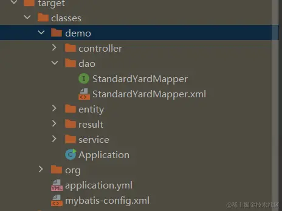

MyBatis是一款优秀的数据持久层ORM框架，被广泛地应用于应用系统。 
MyBatis能够非常灵活地实现动态SQL,可以使用XML或注解来配置和映射原 生信息，能够轻松地将Java的POJO(Plain Ordinary Java Object,普通的 Java对象)与数据库中的表和字段进行映射关联。


# 1 pom文件写法

pom文件需要写入springboot依赖、mybatis依赖和postgresql依赖

```xml
    <dependency>
        <groupId>org.mybatis.spring.boot</groupId>
        <artifactId>mybatis-spring-boot-starter</artifactId>
        <version>2.3.0</version>
    </dependency>
```


# 2 问题：Invalid bound statement (not found)


问题实质就是mapper接口和mapper.xml文件没有映射起来。
常见的错误如下：
1.mapper.xml中的namespace和实际的mapper文件不一致
这个问题其实很好解决，瞪大眼睛，仔仔细细看看，到底对不对应不就好了嘛

2.mapper接口中的方法名和mapper.xml中的id标签不一致
这个问题和上个问题解决方法一样，仔细对对嘛，这个再对不出来，面壁思过吧。

3.上两步的问题都没有，但是还是不行，可能原因就是，没有构建进去，打开target看看对应的mapper.xml文件在不在



如果没有构建dao层里的xml文件，则需要在pom文件的build节点里写入下列依赖：

```xml
<resources>
    <resource>
        <directory>src/main/java</directory>
        <includes>
            <include>**/*.properties</include>
            <include>**/*.xml</include>
        </includes>
        <filtering>false</filtering>
    </resource>
    <resource>
        <directory>src/main/resources</directory>
        <includes>
            <include>**/*.yml</include>
            <include>**/*.xml</include>
        </includes>
        <filtering>false</filtering>
    </resource>
</resources>

作者：新罗新落
链接：https://juejin.cn/post/7305572311813586955
来源：稀土掘金
著作权归作者所有。商业转载请联系作者获得授权，非商业转载请注明出处。
```


# 3 application.yml 中加入 mybatis 相关配置 

application.yml 是 Spring Boot 应用程序的配置文件，用于配置 Spring Boot 应用程序的各种属性和特性。它包含了应用程序的所有配置信息，例如数据库连接信息、日志配置、缓存配置、端口号等

```yaml
server:
  #端口号
  port: 8088
  #项目名，如果不设定，默认是 /

spring:
  datasource:
    url: jdbc:postgresql://192.168.10.12:5432/wuxue_argculture
    username: postgres
    password: postgres
    driver-class-name: org.postgresql.Driver

logging:
  level:
    com.demo.mapper: debug

mybatis:
  #标注mybatis配置文件的位置, 配置 mybatis-config.xml 路径mybatis-config.xml 中配置 MyBatis 基础属性
  config-location: classpath:mybatis-config.xml
  #标注待解析的mapper的xml文件位置, 配置 Mapper 对应的 XML 文件路径
  mapper-locations: classpath:demo/dao/*.xml
  #标注实体类位置, 配置项目中实体类包路径
  type-aliases-package: demo.entity

```


---

**注意：**

可以在appllication.yml中直接配置Mybatis，不通过mybatis-config.xml

```shell
##指定mybatis输出日志的位置, 输出控制台
#mybatis:
#  configuration:
#    log-impl: org.apache.ibatis.logging.stdout.StdOutImpl
```

两种配置方式只能二选一，不能同时使用application.yml中的configuration和mybatis-config.xml文件配置mybabis

即： application.yml中configuration 和 configLocation 两个属性不能同时存在，否则会报错

# 4 mybatis-config.xml

文件放置的位置 在 /src/main/resource下创建Mybatis配置文件 mybatis-config.xml 和 映射文件目录mapper 

mybatis-config.xml 是 MyBatis 的配置文件，用于配置 MyBatis 的全局属性、类型别名、映射器等。它是 MyBatis 框架的核心配置文件，必须存在并且必须正确配置，否则 MyBatis 将无法正常工作。

```xml
<?xml version="1.0" encoding="UTF-8" ?>
<!DOCTYPE configuration PUBLIC "-//mybatis.org//DTD Config 3.0//EN"
        "http://mybatis.org/dtd/mybatis-3-config.dtd">

<configuration>
    <settings>
        <!-- #开启mybatis驼峰式命名规则自动转换 -->
        <setting name="mapUnderscoreToCamelCase" value="true" />
    </settings>
    <!-- 类型别名配置 -->
    <typeAliases>
        <typeAlias type="demo.entity.StandardYard" alias="StandardYard"/>
        <!-- 添加其他类型别名 -->
    </typeAliases>
</configuration>

```

`<setting name="mapUnderscoreToCamelCase" value="true" />` 是用来开启 MyBatis 的驼峰式命名规则自动转换功能。在数据库中，有些表或者列使用下划线（例如 first_name）来命名，而在 Java 中更倾向于使用驼峰式命名（例如 firstName）。通过设置 mapUnderscoreToCamelCase 为 true，MyBatis 将会自动将数据库中带下划线的命名规则转换为驼峰式命名规则，这样在编写 SQL 映射文件时就可以直接使用驼峰式的命名方式，而不必担心与数据库命名不一致的问题


# 5 Mapper层的xml 的写法 

文件放置的位置 在 /src/main/resource下 映射文件目录mapper  中 


在 MyBatis 的 Mapper 层 XML 文件中，通常定义了 SQL 映射语句和与之相关的一些参数。下面是几个常见的参数及其含义：
- namespace：就是 那个mapper文件的名字. 用于指定该 XML 文件对应的 Mapper 接口的完全限定名。通过设置 `namespace`，可以将 XML 文件与对应的 Java 接口关联起来
- resultMap：指定结果集映射关系的标识符，用于将数据库查询结果映射到 Java 对象。 **这里可以创造字段映射，实现实体类属性名称和表字段的解耦**
    - 将 table 的 column 名称 和  自己定义好的 一个 entity 层中的 某个 class 中的 他的 property 名字相对应 
    - `<resultMap type="tech.pdai.springboot.postgre.mybatisplus.entity.User" id="UserResult">`
        - 可以自己起的 的 id 名字，或者是内联的结果映射定义。
        - type 的值 对应的 entity layer 中那个文件的 文职 
- resultType：指定单个结果对象的类型。可以是 Java 对象的完全限定名（例如：com.example.User），也可以是基本数据类型。
- `<sql id="YZHselectUserSql">` 预写好 一段sql 代码, 通过  `<include refid="YZHselectUserSql"/>`  引用他 
- `<select id="getStandardYards">`    : getStandardYards 是  service 中某个class 的某个方法 


## 5.1 例子 


```xml

<?xml version="1.0" encoding="UTF-8" ?>
<!DOCTYPE mapper
PUBLIC "-//mybatis.org//DTD Mapper 3.0//EN"
"http://mybatis.org/dtd/mybatis-3-mapper.dtd">
<mapper namespace="tech.pdai.springboot.postgre.mybatisplus.dao.IUserDao">

	<resultMap type="tech.pdai.springboot.postgre.mybatisplus.entity.User" id="UserResult">
		<id     property="id"       	column="id"      		/>
		<result property="userName"     column="user_name"    	/>
		<result property="password"     column="password"    	/>
		<result property="email"        column="email"        	/>
		<result property="phoneNumber"  column="phone_number"  	/>
		<result property="description"  column="description"  	/>
		<result property="createTime"   column="create_time"  typeHandler="tech.pdai.springboot.postgre.mybatisplus.config.PgTimestampZTypeHandler"	/>
		<result property="updateTime"   column="update_time"  typeHandler="tech.pdai.springboot.postgre.mybatisplus.config.PgTimestampZTypeHandler"	/>
		<collection property="roles" ofType="tech.pdai.springboot.postgre.mybatisplus.entity.Role">
			<result property="id" column="id"  />
			<result property="name" column="name"  />
			<result property="roleKey" column="role_key"  />
			<result property="description" column="description"  />
			<result property="createTime"   column="create_time"  typeHandler="tech.pdai.springboot.postgre.mybatisplus.config.PgTimestampZTypeHandler"	/>
			<result property="updateTime"   column="update_time"  typeHandler="tech.pdai.springboot.postgre.mybatisplus.config.PgTimestampZTypeHandler"	/>
		</collection>
	</resultMap>
	
	<sql id="selectUserSql">
        select u.id, u.password, u.user_name, u.email, u.phone_number, u.description, u.create_time, u.update_time, r.name, r.role_key, r.description, r.create_time, r.update_time
		from tb_user u
		left join tb_user_role ur on u.id=ur.user_id
		inner join tb_role r on ur.role_id=r.id
    </sql>
	
	<select id="findList" parameterType="tech.pdai.springboot.postgre.mybatisplus.entity.query.UserQueryBean" resultMap="UserResult">
		<include refid="selectUserSql"/>
		where u.id != 0
		<if test="userName != null and userName != ''">
			AND u.user_name like concat('%', #{user_name}, '%')
		</if>
		<if test="description != null and description != ''">
			AND u.description like concat('%', #{description}, '%')
		</if>
		<if test="phoneNumber != null and phoneNumber != ''">
			AND u.phone_number like concat('%', #{phoneNumber}, '%')
		</if>
		<if test="email != null and email != ''">
			AND u.email like concat('%', #{email}, '%')
		</if>
	</select>
	
</mapper> 

```


```xml
<?xml version="1.0" encoding="UTF-8"?>
<!DOCTYPE mapper PUBLIC "-//mybatis.org//DTD Mapper 3.0//EN" "http://mybatis.org/dtd/mybatis-3-mapper.dtd">
<mapper namespace="com.xiezhr.mapper.SysUserMapper">
    <resultMap type="com.xiezhr.model.entity.SysUser" id="SysUserMap">
        <result property="id" column="id" jdbcType="INTEGER"/>
        <result property="username" column="username" jdbcType="VARCHAR"/>
        <result property="nickname" column="nickname" jdbcType="VARCHAR"/>
        <result property="password" column="password" jdbcType="VARCHAR"/>
        <result property="sex" column="sex" jdbcType="VARCHAR"/>
        <result property="birthday" column="birthday" jdbcType="TIMESTAMP"/>
        <result property="email" column="email" jdbcType="VARCHAR"/>
        <result property="phone" column="phone" jdbcType="VARCHAR"/>
        <result property="addr" column="addr" jdbcType="VARCHAR"/>
        <result property="stopFlag" column="stop_flag" jdbcType="VARCHAR"/>
        <result property="createTime" column="create_time" jdbcType="TIMESTAMP"/>
        <result property="updateTime" column="update_time" jdbcType="TIMESTAMP"/>
    </resultMap>
    <!--查询所有用户信息-->
    <select id="querySyserList" resultMap="SysUserMap">
        select * from sys_user
    </select>
</mapper>
```


# 6 直接写在mapper文件的的class 中: CRUD 注解


```java
@Mapper
public interface UserMapper{
    @Insert("insert into user values (#id},#fusername},#password},#birthday})")
    int add(Useruser);

    @Update("update user set username=#{username},password=#{password},birthday=#{birthday}where id=#{id}")
    int update(User user);

    @Delete("delete * from user where id=#fid]")
    int delete(int id);

    @select("select * from user where id=#{id}")
    User findById(int id);
    
    @Select("select * from user")
    List<User>getAll();
}    
```

